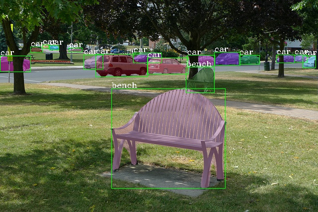

# VoVNet-v2 backbone networks in mmdetectionv-1.20
Efficient Backbone Network for Object Detection and Segmentation
In this project, we release code for VoVNet-v2 backbone network (introduced by CenterMask) in mmdetectionv1.20 as a extention form. VoVNet can extract diverse feature representation efficiently by using One-Shot Aggregation (OSA) module that concatenates subsequent layers at once. Since the OSA module can capture multi-scale receptive fields, the diversifed feature maps allow object detection and segmentation to address multi-scale objects and pixels well, especially robust on small objects. VoVNet-v2 improves VoVNet-v1 by adding identity mapping that eases the optimization problem and effective SE (Squeeze-and-Excitation) that enhances the diversified feature representation.

  

thanks to https://github.com/youngwanLEE/vovnet-detectron2

## Based on MMDetection-1.2.0

## Introduction

The master branch works with **PyTorch 1.1 to 1.4**.

mmdetection is an open source object detection toolbox based on PyTorch. It is
a part of the open-mmlab project developed by [Multimedia Laboratory, CUHK](http://mmlab.ie.cuhk.edu.hk/).

### Major features

- **Modular Design**

  We decompose the detection framework into different components and one can easily construct a customized object detection framework by combining different modules.

- **Support of multiple frameworks out of box**

  The toolbox directly supports popular and contemporary detection frameworks, *e.g.* Faster RCNN, Mask RCNN, RetinaNet, etc.

- **High efficiency**

  All basic bbox and mask operations run on GPUs now. The training speed is faster than or comparable to other codebases, including [Detectron](https://github.com/facebookresearch/Detectron), [maskrcnn-benchmark](https://github.com/facebookresearch/maskrcnn-benchmark) and [SimpleDet](https://github.com/TuSimple/simpledet).

- **State of the art**

  The toolbox stems from the codebase developed by the *MMDet* team, who won [COCO Detection Challenge](http://cocodataset.org/#detection-leaderboard) in 2018, and we keep pushing it forward.

Apart from MMDetection, we also released a library [mmcv](https://github.com/open-mmlab/mmcv) for computer vision research, which is heavily depended on by this toolbox.

## License

This project is released under the [Apache 2.0 license](LICENSE).

## Installation

Please refer to [INSTALL.md](docs/INSTALL.md) for installation and dataset preparation.

## Get Started

Please see [GETTING_STARTED.md](docs/GETTING_STARTED.md) for the basic usage of MMDetection.

## Contributing

We appreciate all contributions to improve MMDetection. Please refer to [CONTRIBUTING.md](.github/CONTRIBUTING.md) for the contributing guideline.

## Acknowledgement

MMDetection is an open source project that is contributed by researchers and engineers from various colleges and companies. We appreciate all the contributors who implement their methods or add new features, as well as users who give valuable feedbacks.
We wish that the toolbox and benchmark could serve the growing research community by providing a flexible toolkit to reimplement existing methods and develop their own new detectors.

## Contact

This repo is currently maintained by Kai Chen ([@hellock](http://github.com/hellock)), Yuhang Cao ([@yhcao6](https://github.com/yhcao6)), Wenwei Zhang ([@ZwwWayne](https://github.com/ZwwWayne)),
Jiarui Xu ([@xvjiarui](https://github.com/xvjiarui)). Other core developers include Jiangmiao Pang ([@OceanPang](https://github.com/OceanPang)) and Jiaqi Wang ([@myownskyW7](https://github.com/myownskyW7)).

# mmdetection-vovnet

